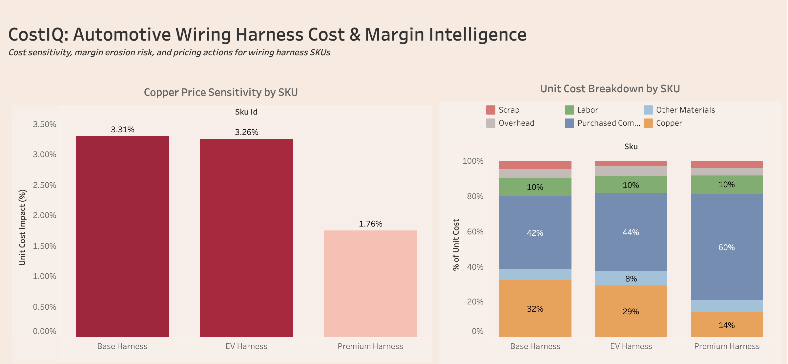
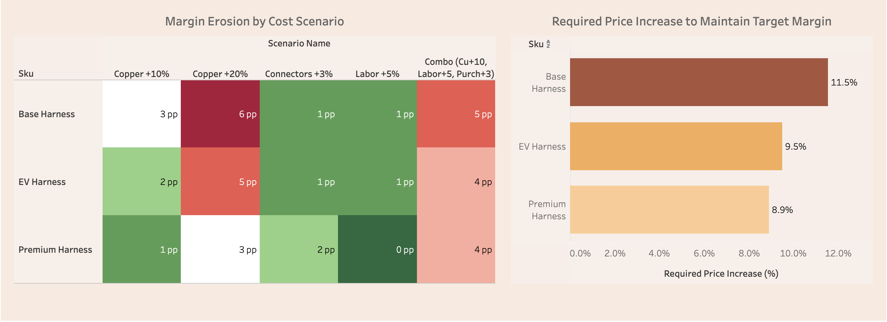

# CostIQ — Tier-1 Door Harness Cost Engineering & Margin Governance Engine

A modular cost engineering simulation system built for a Tier-1 automotive door harness program. CostIQ computes BOM-level unit cost across 3 SKUs and 34 BOM lines, runs scenario simulations against commodity and labor volatility, and enforces margin-floor governance — outputting decision-grade analytics to Tableau.

### Dashboard Preview




> **[View live on Tableau Public →](https://public.tableau.com/app/profile/selvanagendran.rathinam/viz/CostIQTier-1AutomotiveCostEngineeringMarginIntelligenceDashboard/Dashboard1)**

---

## Project Overview

**Domain:** Supply Chain Finance · Cost Engineering · Program Management  
**Stack:** PostgreSQL · Python · Tableau Public  
**Scope:** 3 SKUs · 34 BOM lines · 6 scenarios · 36-month copper index · 8 governance queries

CostIQ mirrors real Tier-1 cost-sheet architecture by separating commodity pricing (copper via LME index) from static BOM components, enabling dynamic what-if analysis when material markets move.

---

## Architecture

```
┌─────────────────────────────────────────────────────────┐
│                   PostgreSQL Database                    │
│               costiq_door_harness (10 tables)            │
│                                                         │
│  Reference:  sku · assumption · bom_line · scenario     │
│  Pricing:    customer_price · market_index · run_config  │
│  Demand:     demand_actual_monthly · demand_forecast_rolling │
│  Output:     result_cost_scenario (engine writes here)   │
└──────────────────────┬──────────────────────────────────┘
                       │
              ┌────────▼────────┐
              │  Python Engine   │
              │ cost_engine.py   │
              │                  │
              │ • Reads BOM +    │
              │   copper index   │
              │ • Applies scenario│
              │   multipliers    │
              │ • Computes unit  │
              │   cost per SKU   │
              │ • Flags margin   │
              │   breaches       │
              │ • Writes results │
              └────────┬─────────┘
                       │
              ┌────────▼────────┐
              │  SQL Governance  │
              │  8 Queries       │
              │                  │
              │ Q1-Q8 analytics  │
              │ exported as CSV  │
              └────────┬─────────┘
                       │
              ┌────────▼────────┐
              │ Tableau Public   │
              │ Dashboard        │
              │                  │
              │ • Cost waterfall │
              │ • Margin heatmap │
              │ • Price adj table│
              └──────────────────┘
```

---

## Database Schema

**10 tables** in `costiq_door_harness` with enforced foreign key relationships:

| Table | Role | Key Columns |
|---|---|---|
| `sku` | 3 door harness variants | `sku_id`, `sku_name`, `variant` |
| `assumption` | Cost driver parameters per SKU | `copper_weight_kg`, `scrap_pct`, `labor_minutes`, `labor_rate_hr`, `overhead_pct` |
| `bom_line` | 34 material line items | `sku_id`, `item_name`, `item_type`, `unit_cost`, `qty` |
| `market_index` | 36-month LME copper price series | `as_of_month`, `index_name`, `price_per_kg` |
| `scenario` | 6 volatility scenarios | `scenario_name`, `copper_mult`, `labor_mult`, `purchased_mult` |
| `customer_price` | OEM selling price per SKU | `sku_id`, `price_per_unit` |
| `run_config` | Baseline month + index selection | `default_as_of_month`, `default_index_name` |
| `result_cost_scenario` | Engine output (18 rows: 3 SKUs × 6 scenarios) | `total_unit_cost`, `margin_pct`, `margin_flag`, `run_timestamp` |
| `demand_actual_monthly` | 36 months of demand actuals (for DemandIQ) | `sku_id`, `month`, `actual_units` |
| `demand_forecast_rolling` | Rolling forecast revisions (for DemandIQ) | `sku_id`, `month`, `horizon`, `forecast_units` |

---

## Python Cost Engine

`cost_engine.py` executes the full cost computation pipeline:

1. **Connect** to PostgreSQL via `psycopg2`
2. **Load** baseline copper price from `market_index` × `run_config`
3. **Load** BOM costs, assumptions, selling prices, and scenario definitions
4. **Compute** unit cost per SKU per scenario:
   - `copper_cost = copper_weight_kg × copper_price × copper_multiplier`
   - `non_copper_cost` and `purchased_cost` from BOM rollup with scenario multipliers
   - `labor_cost = (labor_minutes / 60) × labor_rate_hr × labor_multiplier`
   - `overhead_cost = labor_cost × overhead_pct`
   - `scrap_adjustment = subtotal × scrap_pct`
5. **Evaluate** margin governance: `margin_pct = (price - cost) / price`; flag if below configurable floor (default 15%)
6. **Persist** all 18 result rows to `result_cost_scenario` with `scenario_id`, `as_of_month`, `run_timestamp` for auditability

---

## Governance Queries (Phase 4)

8 SQL queries answering business-critical cost engineering questions:

| # | Query | Business Question |
|---|---|---|
| Q1 | Copper Sensitivity Ranking | Which SKU's unit cost moves the most when copper changes? |
| Q2 | Cost Bucket Dominance | What % of unit cost does each cost driver represent at baseline? |
| Q3 | First Margin Breach | At what scenario does each SKU trip the margin floor? |
| Q4 | Required Price to Restore Margin | What selling price maintains 15% margin under each scenario? |
| Q5 | Cost Change Attribution | How much of a cost increase came from copper vs labor vs purchased? |
| Q6 | Margin-at-Risk Ranking | Which SKU has the worst margin exposure across all scenarios? |
| Q7 | Price Adjustment Delta | How many dollars more does the OEM need to pay per unit? |
| Q8 | Margin Erosion in Basis Points | How many bps of margin does each scenario erode per SKU? |

---

## Key Findings

| SKU | Baseline Margin | Worst-Case Margin | Breach Count | Price Gap |
|---|---|---|---|---|
| DH-BASE | 5.28% | 5.22% | 6/6 scenarios | +$5.95 to +$5.98 |
| DH-PREM | 7.48% | 7.44% | 6/6 scenarios | +$5.66 to +$5.69 |
| DH-EVL | 23.08% | 23.03% | 0/6 scenarios | −$6.65 (headroom) |

- **DH-BASE** is the most copper-sensitive SKU — copper drives 96% of cost movement under the +20% scenario
- **DH-PREM** is most exposed to purchased component volatility ($35.75 purchased cost, 60% of unit cost)
- **DH-EVL** never breaches the margin floor and carries $6.65 of pricing headroom

---

## Tableau Dashboard

**[View on Tableau Public →](https://public.tableau.com/app/profile/selvanagendran.rathinam/viz/CostIQTier-1AutomotiveCostEngineeringMarginIntelligenceDashboard/Dashboard1)**

Published with 4 views:

- **Copper Price Sensitivity by SKU** — Bar chart ranking SKUs by unit cost impact (%) under copper volatility; Base Harness leads at 3.31%
- **Unit Cost Breakdown by SKU** — 100% stacked bar showing cost bucket composition at baseline; Premium Harness is 60% purchased components, Base Harness is 32% copper
- **Margin Erosion by Cost Scenario** — SKU × scenario heatmap in percentage points; Copper +20% erodes Base Harness by 6 pp
- **Required Price Increase to Maintain Target Margin** — Horizontal bar showing % price pass-through needed; Base Harness requires 11.5%, Premium Harness 8.9%

---

## Setup & Installation

### Prerequisites

- PostgreSQL (via pgAdmin)
- Python 3.10+
- Tableau Public (free)

### Steps

```bash
# 1. Clone the repo
git clone https://github.com/<your-username>/costiq-door-harness.git
cd costiq-door-harness

# 2. Install Python dependency
pip3 install psycopg2-binary

# 3. Create the database in pgAdmin
#    Database name: costiq_door_harness

# 4. Run the schema
#    Open pgAdmin Query Tool → run sql/postgres_schema.sql

# 5. Import CSVs (in order — foreign keys matter)
#    sku → assumption → bom_line → market_index → scenario →
#    customer_price → run_config → demand_actual_monthly →
#    demand_forecast_rolling

# 6. Update password in cost_engine.py, then run
python3 cost_engine.py

# 7. Export governance query results as CSV for Tableau
#    Run each query in sql/governance_queries.sql → export to csv/
```

---

## Project Structure

```
costiq-door-harness/
├── README.md
├── sql/
│   ├── postgres_schema.sql        # 10-table schema with constraints
│   └── governance_queries.sql     # Q1–Q8 analytics queries
├── data/
│   ├── sku.csv
│   ├── assumption.csv
│   ├── bom_line.csv
│   ├── market_index_copper_monthly.csv
│   ├── scenario.csv
│   ├── customer_price.csv
│   ├── run_config.csv
│   ├── demand_actual_monthly.csv
│   └── demand_forecast_rolling.csv
├── engine/
│   └── cost_engine.py             # Python cost computation engine
└── tableau/
    ├── q1_copper_sensitivity.csv
    ├── q2_cost_bucket_dominance.csv
    ├── q3_first_margin_breach.csv
    ├── q4_required_price.csv
    ├── q5_cost_attribution.csv
    ├── q6_margin_at_risk.csv
    ├── q7_price_adjustment_delta.csv
    └── q8_margin_erosion_bps.csv
```

---

## Resume Bullets

**CostIQ — Tier-1 Door Harness Cost Engineering & Margin Governance Engine**

- Designed a normalized PostgreSQL schema and Python cost engine to compute BOM-level unit cost for a Tier-1 door harness program across 3 SKUs / 34 BOM lines; decomposed unit cost into five discrete buckets — copper commodity exposure, purchased components, direct labor, overhead absorption, and scrap/yield loss — with copper pricing dynamically sourced from a 36-month LME index.

- Engineered a scenario simulator applying ±20% volatility to copper, labor, and purchased components against a 36-month LME copper index; outputs persisted to a versioned results table (`scenario_id`, `as_of_month`, `run_timestamp`) for full traceability and audit.

- Implemented margin-floor governance (15% configurable threshold) to programmatically flag at-risk SKUs and compute required price adjustments; decision outputs published to Tableau via a cost waterfall and SKU × scenario margin heatmap.

---

## Related Project

**[DemandIQ — Forecast Accuracy & Supply Risk Engine](https://github.com/<your-username>/demandiq-door-harness)** extends CostIQ's database with rolling forecast revision analytics across 36 months, computing MAPE, directional bias, and forecast churn by SKU — translating demand volatility into procurement and margin exposure.

---

## License

This is a portfolio simulation project for educational and demonstration purposes.
